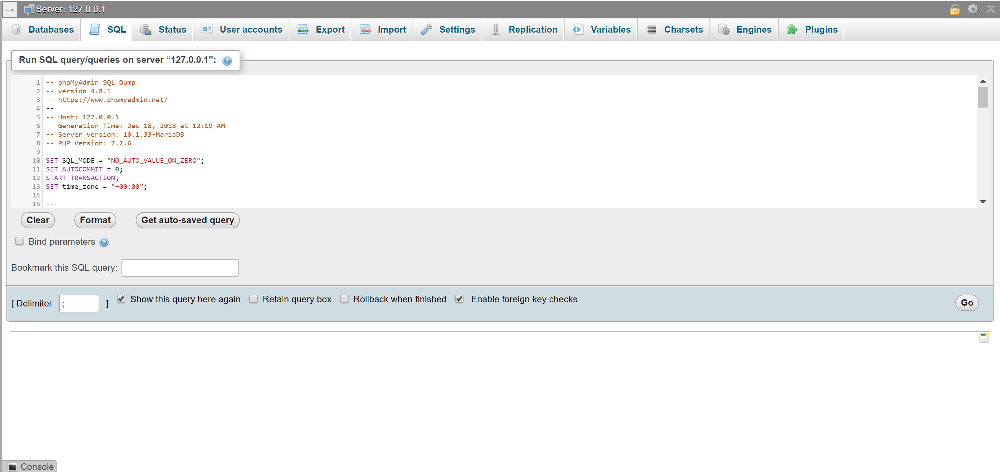
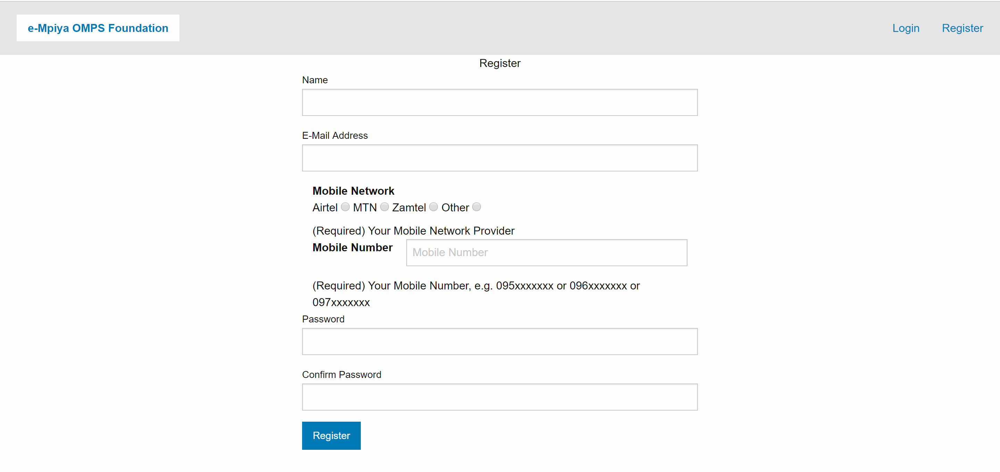
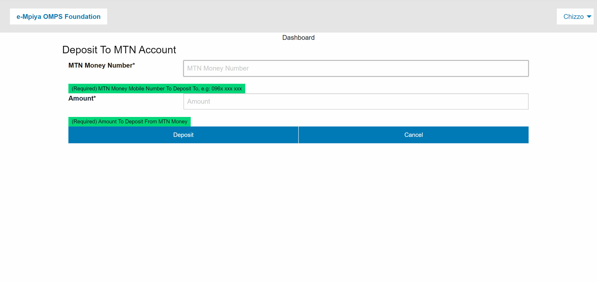
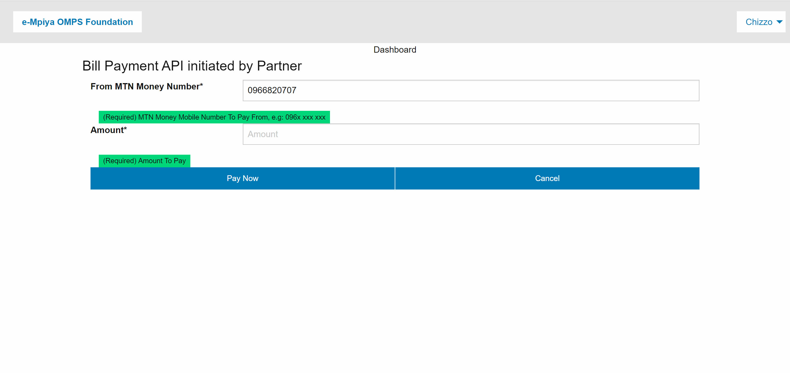
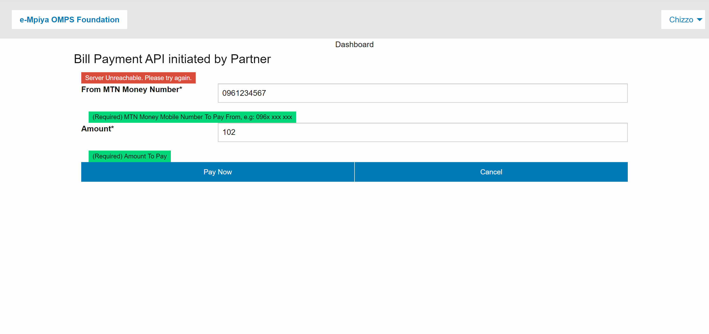
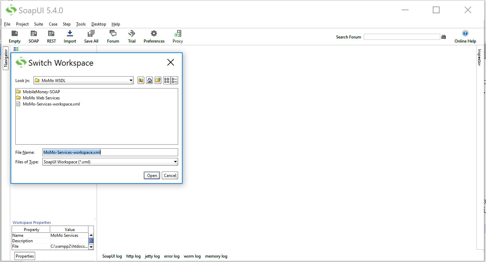
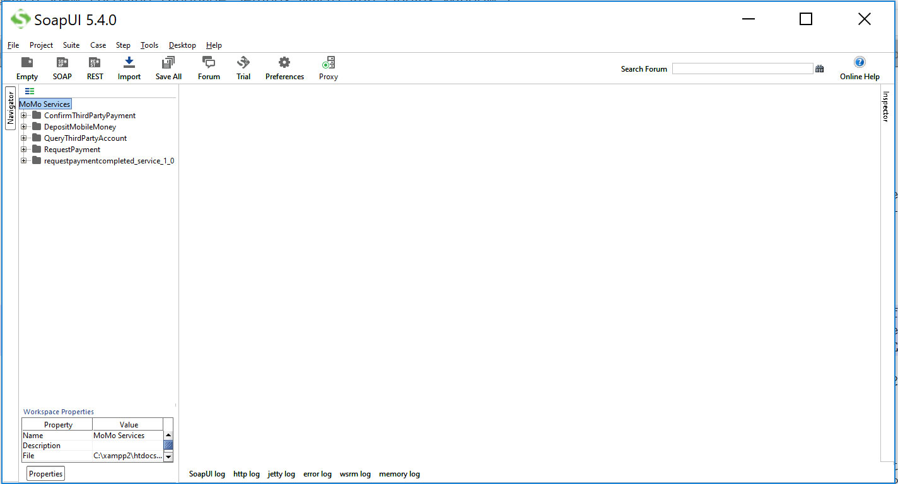
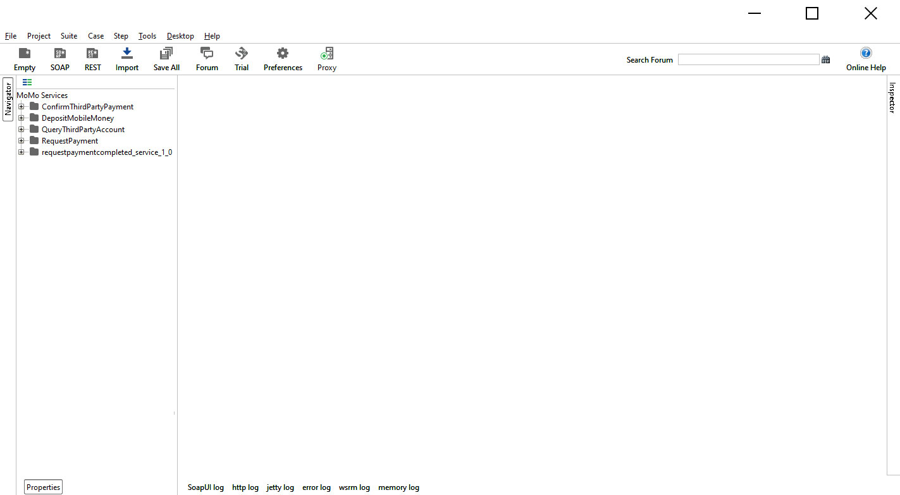
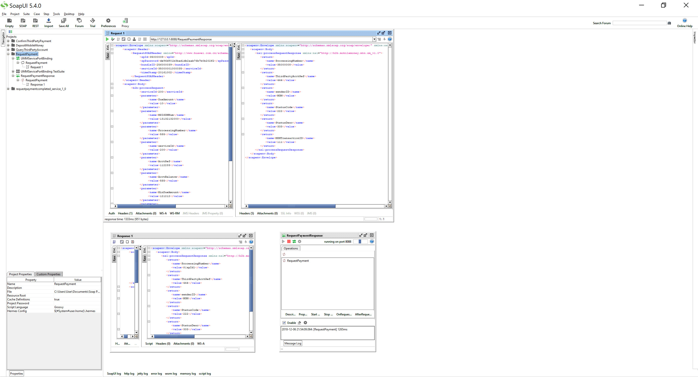

# e-Mpiya Foundation
e-Mpiya Online and Mobile Payment System (OMPS) is a [One Ziko](https://oneziko.com/) payment service that leverages on existing payment options to bridge financial inclusion in Zambia. This repository is the foundation on which this payment system based. Feel free to contribute, use and improve upon it.

## Table Of Contents (TOC)
1.	Running Web Client
	1.	Running Web Client
	2.	Create User and Login

2.	Setup SoapUI Test Environment
	1.	Identify API
	2.	Get WSDL
	3.	Import WSDL into SOAPUI
	4.	Create Mockservices

3.	Test Client and Web Services

4. Customisation
	
## Some Things To Note
With the TOC outlined above, we can start by aligning with expectations. Ideally, it would be good to integrate with all three (3) mobile network operators (MNOs) in Zambia, i.e. Airtel, MTN and ZAMTEL, and also other mobile financial services such as Zoona, Kazang, SpeedPay, etc. But as it stands, we are restricted by non-availability of public Application Programming Interfaces (API's) for developers to work with from the mentioned services. Hopefully, by the time you are reading this, that would have changed.

So, for now;
* We are going to work with [MTN API](https://developer.mtn.com/community/portal/site.action?s=devsite&c=Home), since MTN has a developer portal with a bunch of useful resources. As and when other third-parties open up, we can integrate with them.
* We are not going to be working with MTN sandbox or test environment. I will take it we are starting from scratch and hence we will first need to establish a basis with which to argue viability of the project. Therefore, we will use [SoapUI](https://www.soapui.org/downloads/latest-release.html) to create a local test environment with which to develop.
* We will be using the [MobileMoney SOAP API specification](https://developer.mtn.com/community/portal/site.action?s=devsite&c=detailsResource&resourceId=613&categoryId=DEV1000002&search=DEV1000002&resourceName=MobileMoney%20API%20specification%20v11&h=firresource&currentPage=1&osIds=DEV2000001,DEV2000002,DEV2000003,DEV2000004,DEV2000005&flag=fromRight&fromApiResource=yes) and as at now, 1st December, 2018, the latest WSDL files we are using are here:  [MobileMoney-1_7 phase 7_1](https://developer.mtn.com/community/portal/site.action?s=devsite&c=detailsResource&lang=en&t=web&resourceId=555&resourceName=%3Cspan%20style=%22color:#1483BB;background:#FFFFFF;%22%3EMobileMoney%3C/span%3E-1_7%20phase%207_1&categoryId=&h=resourceSearch&searchName=&search=&currentPage=1)
* We will have to come up with a way of requesting and responding in SOAP format, after setting up a test environment. There are so many ways you can do this, actually, MTN developer portal has guides in three (3) programming languages: C#, JAVA and PHP, with Apache Tomcat. We will be using PHP with Laravel framework and the method we will be using is not documented on the MTN portal, this is what I have found to be a convenient way to achieve communication with server without third-party libraries. But all in all, the principles are the same, using GET and POST.
* Lastly, if you're at all lost and need some background, I recommend that you look at this presentation that we had at Bongo Hive a while back: [Code and notes for MTN API session at Bongo Hive](https://github.com/Chizzoz/MTN-API-BongoHive-Session).
* And one last thing, I don't think we will include any database integration with this repository, you can decide how and what to use to store data. We will be satisfied with successfully requesting and responding to the API as required.

## Filling In The Blanks
1.	**Running Web Client**
	1.	**Running Web Client:**
    
	**STOP** if you do not intend to use PHP for your web client, and are planning on using another programming language or technology, skip this stage and head on to step 2: *Setup SoapUI Test Environment* to open or create SOAP webservices and Mockservices to simulate server responses. This section will instruct you on how to run web client using Laravel PHP Framework.

		The following are the server requirements:
		* PHP >= 7.1.3
		* OpenSSL PHP Extension
		* PDO PHP Extension
		* Mbstring PHP Extension
		* Tokenizer PHP Extension
		* XML PHP Extension
		* Ctype PHP Extension
		* JSON PHP Extension
		* BCMath PHP Extension
		
		Clone and cd into this project folder OR download this project, then extract ``` e-mpiya-foundation ``` project folder into your server root and then visit ``` http://localhost/e-mpiya-foundation ``` using your browser.
	
	2. **Creating MySQL or MariaDB App Database**
		
		You can create the App database by either:
		1. logging into your phpMyAdmin, creating ``` empiya_db ``` database, with collation ``` utf8mb4_unicode_ci ```. Then in CMD or console, running database migrations using ``` php artisan migrate ``` OR
		2. logging into your phpMyAdmin, clicking SQL tab and then, copying, pasting and running the SQL queries in the file ``` e-mpiya-foundation\SQL\e-mpiya-dump.sql ```.
		
		
		
		You will now need to confirm if *DB_DATABASE*, *DB_USERNAME* and *DB_PASSWORD* are correct according to your database configuration in ``` e-mpiya-foundation\.env ``` file.
		
	3.	**Create User and Login:**
	
		Click on Register, that will take you to ``` http://localhost/e-mpiya-foundation/register ```. Enter the required details, after which you will be logged in and presented  with the home page with dashboard.
		
		
		
		
		
		Click *Deposit MTN Money* or *MTN Bill Payment API initiated by Partner* and you will get to one of the screens shown below. Enter an amount and click *Pay Now*. You will get a server error as the MTN API Web Services are not running, you will set those up in step 2 below.
		
		
		
		
		
		
		
2.	**Setup SoapUI Test Environment**

	**TL;DR**
	You can either follow the four (4) steps below, which is quite a lengthy process, to create your own web services **OR** you can open a SoapUI XML Workspace, already created with the web services, included in this repository, i.e. ```` e-mpiya-foundation\MoMo WSDL\MoMo-Services-workspace.xml ````.
	Simply launch SoapUI, click *File*, then click *Switch Workspace* and locate and open *MoMo-Services-workspace.xml*

	
	
	After opening *MoMo-Services-workspace.xml*, your workspace should look as shown below. Make sure to maintain the folder structure for the *MoMo WSDL* folder
	

	1.	**Identify API:**
	
		It seems I was rushing things, this was already mentioned adove. Download Mobile Money API Specification: [MobileMoney SOAP API specification](https://developer.mtn.com/community/portal/site.action?s=devsite&c=detailsResource&resourceId=613&categoryId=DEV1000002&search=DEV1000002&resourceName=MobileMoney%20API%20specification%20v11&h=firresource&currentPage=1&osIds=DEV2000001,DEV2000002,DEV2000003,DEV2000004,DEV2000005&flag=fromRight&fromApiResource=yes)
		
		In this repository, find it here: [SDP Solution API Reference PDF](readme_assets/SDP%20Solution%20API%20Reference%20(MobileMoney%2CSecurity).pdf)
		
	2.	**Get WSDL:**
	
		Then download and extract WSDL files to help develop web services: [MobileMoney-1_7 phase 7_1](https://developer.mtn.com/community/portal/site.action?s=devsite&c=detailsResource&lang=en&t=web&resourceId=555&resourceName=%3Cspan%20style=%22color:#1483BB;background:#FFFFFF;%22%3EMobileMoney%3C/span%3E-1_7%20phase%207_1&categoryId=&h=resourceSearch&searchName=&search=&currentPage=1)
		
		In this repository, find them here: [MobileMoney-SOAP 1.7](MoMo%20WSDL/MobileMoney-SOAP/1.7)
		
	3.	**Import WSDL into SOAPUI:**
	
		Launch SoapUI, click create new SOAP project and then locate the relevant WSDL file to import. In our case, we started with *RequestPayment.wsdl* located in ``` e-mpiya-foundation\MoMo WSDL\MobileMoney-SOAP\1.7 ```, here: [RequestPayment.wsdl](MoMo%20WSDL/MobileMoney-SOAP/1.7/RequestPayment.wsdl)
		
		
		
		Do the same for the other four (4) WSDL files. Final result should look as shown below:
		
		
		
	4.	**Create Mockservices:**
	
		At this stage, you will need to create a MockService for each of the default requests, created with each web service and then make SOAP Request and Response messages as shown in the [SDP Solution API Reference PDF](readme_assets/SDP%20Solution%20API%20Reference%20(MobileMoney%2CSecurity).pdf). After running the MockService on a specified URL and port number, a SOAP request sent to the MockService URL and port number should return a Response as shown below:
		
		

3.	**Test Client and Web Services:**

At this stage, you can open DepositMobileMoney, RequestPayment, etc projects by clicking the *+* icon, double click the Mockservice, e.g. DepositMobileMoneyResponse or RequestPaymentResponse and click the green play icon to start the Mockservice. This time, when you send a request to the server by clicking *Deposit* or *Pay Now* buttons, you should get a response. The response has been formatted in plain text and JSON, which can be manipulated in various ways.


4. **Customisation**

Feel free to modify or use any ideas from this project to meet your own requirements. If you are not really familiar with the Laravel project structure. These are the critical sections you need to work on in order to customise the project:
    ..* Controllers: This is where all the magic happens, in here you will find all the code that adds functionality and interacts with database models: ``` e-mpiya-foundation/app/Http/Controllers/ ```
    ..* Views: This is the where all the cosmetic work and frontend stuff happens: ``` e-mpiya-foundation/resources/views/ ```
    ..* Public: This is where you will find all the assets such as CSS, JS, images, etc: ``` e-mpiya-foundation/public/ ```
    ..* Routes: This is where you can specify you web and api urls: ``` e-mpiya-foundation/routes/ ```

*Happy Coding*

~ **THE END** ~
